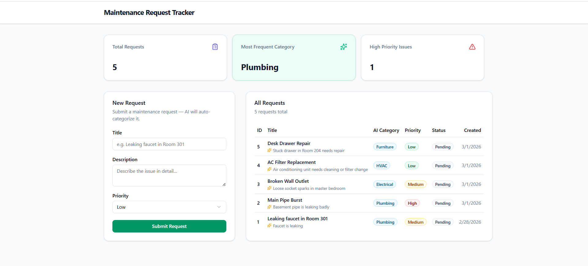

<div align="center">

# 🛠️ AI-Powered Maintenance Request Tracker

**A full-stack smart maintenance management system that leverages AI to auto-categorize, summarize, and analyze service requests in real time.**

[](https://fastapi.tiangolo.com)
[](https://nextjs.org)
[](https://groq.com)
[](https://python.org)
[](#-testing)

[Live Demo](#-live-demo) · [Features](#-key-features) · [Tech Stack](#-tech-stack) · [Setup](#-installation--setup) · [Testing](#-testing)

</div>

---

## 🌐 Live Demo

> 🔗 **https://www.mtr.walaavolidis.com/**

---

## 📸 Screenshot

<div align="center">

![Maintenance Request Tracker Dashboard]

</div>

---

## ✨ Key Features

| Feature | Description |
|---|---|
| 🤖 **AI Auto-Categorization** | Instantly classifies requests into **Plumbing, Electrical, HVAC, Furniture,** or **General** using Llama 3.3 70B via the Groq API — with full Arabic language support. |
| 📝 **AI Summary Generation** | Produces a concise one-sentence summary for every submitted request, so managers can triage at a glance. |
| 📊 **Real-Time Analytics** | Dashboard stat cards display **total requests**, **most frequent category**, and **high-priority issue count** — updated live from the database. |
| 🎨 **Modern Premium UI** | Polished interface built with **shadcn/ui** and **Tailwind CSS** featuring a professional slate/emerald color palette, responsive layout, and smooth loading skeletons. |
| ⚡ **Serverless Ready** | Deployed as a Vercel monorepo — Next.js on the edge, FastAPI as a serverless Python function, Neon PostgreSQL as the managed database. |
| 🧪 **Tested & Reliable** | Backend API covered by **12 automated unit tests** with mocked AI calls, running on an isolated in-memory SQLite database. |

---

## 🏗️ Tech Stack

### Frontend

| Technology | Purpose |
|---|---|
| **Next.js 16** (App Router) | React framework with server components |
| **React 19** | UI library |
| **Tailwind CSS 4** | Utility-first styling |
| **shadcn/ui** | Accessible, pre-styled component library |
| **React Hook Form + Zod** | Type-safe form validation |
| **Axios** | HTTP client |
| **Lucide React** | Icon library |

### Backend

| Technology | Purpose |
|---|---|
| **FastAPI** | High-performance Python API framework |
| **SQLAlchemy 2.x** | ORM with modern `Mapped` type annotations |
| **Pydantic v2** | Request/response validation & settings management |
| **Groq SDK** | AI inference (Llama-3.3-70b-versatile) |
| **Uvicorn** | ASGI server |

### Infrastructure

| Technology | Purpose |
|---|---|
| **Neon PostgreSQL** | Serverless managed database |
| **Vercel** | Hosting (Next.js + Python serverless functions) |
| **pytest + pytest-cov** | Automated testing & coverage |

---

## 📁 Project Structure

```
maintenance-tracker-ai/
├── backend/
│   ├── app/
│   │   ├── api/
│   │   │   └── endpoints.py      # API route handlers
│   │   ├── core/
│   │   │   ├── ai_logic.py       # Groq AI categorization & summarization
│   │   │   └── config.py         # Environment settings (pydantic-settings)
│   │   ├── crud.py               # Database operations
│   │   ├── database.py           # Engine, session factory, Base
│   │   ├── main.py               # FastAPI app entry point
│   │   ├── models.py             # SQLAlchemy ORM models
│   │   └── schemas.py            # Pydantic request/response schemas
│   ├── tests/
│   │   ├── conftest.py           # Fixtures: in-memory DB, mocked AI, TestClient
│   │   └── test_api.py           # 12 unit tests for all endpoints
│   ├── .env.example
│   ├── pytest.ini
│   └── requirements.txt
├── frontend/
│   ├── app/                      # Next.js App Router pages
│   ├── components/               # UI components (form, table, stats cards)
│   ├── hooks/                    # Custom React hooks (data fetching)
│   ├── lib/                      # Axios instance & utilities
│   ├── types/                    # TypeScript interfaces
│   └── package.json
├── api/
│   └── index.py                  # Vercel serverless function entry point
├── vercel.json                   # Deployment configuration
└── README.md
```

---

## 🚀 Installation & Setup

### Prerequisites

- **Python** 3.12+
- **Node.js** 18+
- **PostgreSQL** database (or a free [Neon](https://neon.tech) account)
- **Groq API key** (free at [console.groq.com](https://console.groq.com))

---

### 1️⃣ Clone the Repository

```bash
git clone https://github.com/Walaa-Volidis/maintenance-tracker-ai.git
cd maintenance-tracker-ai
```

---

### 2️⃣ Backend Setup

```bash
cd backend

# Create and activate virtual environment
python -m venv venv
venv\Scripts\activate        # Windows
# source venv/bin/activate   # macOS / Linux

# Install dependencies
pip install -r requirements.txt
```

**Configure environment variables:**

```bash
cp .env.example app/.env
```

Edit `app/.env` and fill in your real values:

| Variable | Description |
|---|---|
| `GROQ_API_KEY` | Your Groq API key for AI inference |
| `DATABASE_URL` | PostgreSQL connection string (e.g. Neon) |
| `FRONTEND_URL` | Frontend origin for CORS (default: `http://localhost:3000`) |

**Start the backend server:**

```bash
uvicorn app.main:app --reload
```

> The API will be available at **http://localhost:8000**
> Interactive docs at **http://localhost:8000/docs**

---

### 3️⃣ Frontend Setup

```bash
cd frontend

# Install dependencies
npm install

# Start the development server
npm run dev
```

> The app will be available at **http://localhost:3000**

**Frontend environment** (optional — only needed if backend runs on a different host):

Create `frontend/.env.local`:

```env
NEXT_PUBLIC_API_URL=http://localhost:8000
```

---

## 🧪 Testing

The backend includes **12 automated unit tests** using **pytest**. Tests run against an **in-memory SQLite database** and all AI calls are **mocked** — so they execute instantly without consuming your Groq API quota.

```bash
cd backend

# Run all tests (verbose)
pytest -v

# Run with coverage report
pytest --cov=app --cov-report=term-missing
```

**Test coverage summary:**

| Module | Coverage |
|---|---|
| `endpoints.py` | 100% |
| `crud.py` | 100% |
| `schemas.py` | 100% |
| `main.py` | 100% |
| `config.py` | 100% |
| **Overall** | **81%** |

---

## 📡 API Endpoints

| Method | Endpoint | Description |
|---|---|---|
| `GET` | `/` | Health check |
| `POST` | `/api/requests` | Create a new maintenance request (AI auto-fills category & summary) |
| `GET` | `/api/requests` | List all requests (newest first) |
| `GET` | `/api/analytics/stats` | Dashboard statistics (total, top category, high-priority count) |

---

## 🤖 How the AI Works

1. **User submits** a maintenance request with a title and description.
2. **Groq API** (Llama-3.3-70b-versatile) classifies the description into one of 5 categories in real time.
3. A **second AI call** generates a ≤10-word summary for quick triage.
4. Both the category and summary are saved alongside the request in PostgreSQL.
---
